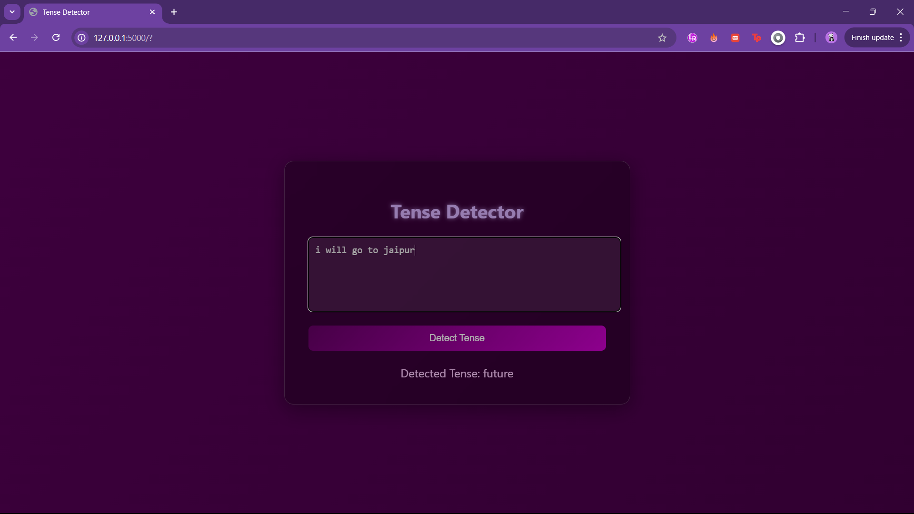

# Tense Detector using NLP

## 📜 Overview
The **Tense Detector** is a powerful Natural Language Processing (NLP) tool that detects the tense (past, present, future) of any given sentence. Built using Python, **NLTK**, and regular expressions, this project leverages rule-based grammar analysis to determine the tense of a sentence based on verb forms.

It’s an excellent project for learning and exploring how NLP techniques like tokenization, part-of-speech tagging, and linguistic grammar rules can be used to solve real-world language problems.


---

## 🛠️ Tech Stack

- **Python** - Primary language used for the implementation.
- **NLTK (Natural Language Toolkit)** - For tokenization, POS tagging, and other NLP tasks.
- **Regular Expressions** - For pattern matching and verb tense identification.
- **Linguistic Grammar Rules** - Rule-based approach to detect tenses.

---

## 🎯 Features

- **Tense Detection**: Detects the tense of a given sentence: **past, present, or future**.
- **Tokenization**: Breaks sentences into words for detailed analysis.
- **POS Tagging**: Identifies parts of speech (e.g., verbs) crucial for tense detection.
- **Grammar-based Rules**: A set of predefined rules to determine the tense based on verb forms.

---

## 💡 Screenshot


---

## 🚀 How to Use

1. **Clone the repository:**

    ```bash
    git clone https://github.com/Ruchi2117/Tense-Detector.git
    ```

2. **Install dependencies:**
    Make sure you have Python installed. You can install the necessary libraries with:

    ```bash
    pip install -r requirements.txt
    ```

3. **Run the Tense Detector:**
    Execute the Python script to test the tense detection:

    ```bash
    python tense_detector.py
    ```

    Enter a sentence, and it will output the detected tense.

---

## 🌱 Getting Started

To contribute or improve the project:

1. **Fork the repository.**
2. **Clone your fork:**

    ```bash
    git clone https://github.com/YOUR-USERNAME/Tense-Detector.git
    ```

3. **Create a new branch for your changes:**

    ```bash
    git checkout -b your-branch-name
    ```

4. **Make changes, commit, and push them back:**

    ```bash
    git add .
    git commit -m "Your message"
    git push origin your-branch-name
    ```
